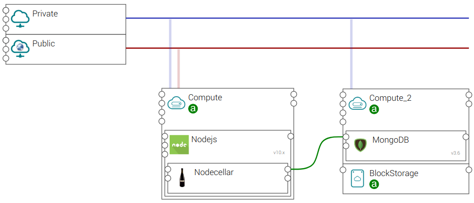

# tosca-tutorials

## Overview

TOSCA is a YAML file that describes a topology of a cloud application. It means, users can describe how they want to
deploy their applications in multiple cloud providers. Figure 1 shows an example, whereby users describe three points:
1. the desired cloud infrastructure (e.g., one public / private `network`, two `compute` nodes, one `block storage`). 
2. the desired software components (e.g., a `nodejs` software component is deployed on the `Compute` node, a `mongodb`
software component is deployed on the `Compute_2` node). Here users can control the lifecycle of the software components
(i.e., how they are installed, updated, deleted) with ansible, python, and shell script.
3. the relationships between the software components (e.g., a `nodecellar` web application connects to the `mongodb`
runtime endpoint on port 27017).
Here users can configure the `nodecellar` and `mongodb` node to setup the relationship with ansible, python, and shell
script.

At runtime, the TOSCA orchestration engine can read the topology description and deploy their applications accordingly.

Figure 1: TOSCA example

The following tutorial shows how users use TOSCA to do so.

## Basic
1. [How to manage the lifecycle (create, update, delete) of a software component on a compute node?](tutorials/Basic_Lifecycle.md "Python example")
2. [How to create a software component using an ansible playbook?](tutorials/Basic_Ansible.md "Ansible example")
3. [How to define a `ConnectsTo` relationship between two software components?](tutorials/Basic_Relationship_ConnectsTo.md "Relationship connects to example")
4. [How to define a custom capability?](tutorials/Basic_Custom_Capability.md "Custom capability")
5. [How to deploy a file or a folder (i.e., a `File` artifact) to a target compute node?](tutorials/Basic_Artifact.md "Artifact")

## Container
1. How to define a docker container application?
2. How to deploy a docker container on Kubernetes?

## Author
* [Tri Hoang Vo](https://www.linkedin.com/in/tri-hoang-vo-395819aa/ "Tri linkedin")

## Copyright
* TOSCA Tutorials brought to you by [Open Telekom Cloud](https://open-telekom-cloud.com), T-Systems International GmbH.
* The examples we used in this tutorial are from [Yorc](https://github.com/ystia/tosca-samples).