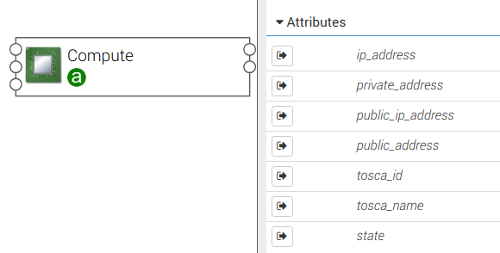
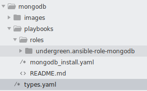
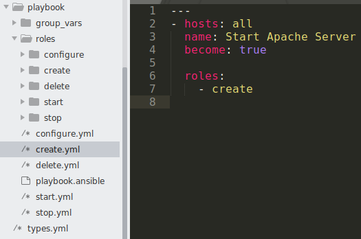

# 2. Create a software component using ansible playbook

In the previous example, we used a python script to implement a software component. In this example, we use an ansible 
playbook to create a mongodb.

#### Step 1. Import yorc-types

```yaml
imports:
  - tosca-normative-types:1.0.0-ALIEN20
  - yorc-types:1.1.0
```

#### Step2. Implement the interfaces

In the `interfaces`, we can use an ansible script `mongodb_install.yaml` as follows:

```yaml
node_types:
  otc.nodes.SoftwareComponent.MongoDB:
    derived_from: org.ystia.nodes.SoftwareComponent
    ...
    interfaces:
      Standard:
        create:
          inputs:
            # HOST is the keyword to get more information about the hosted compute node at runtime
            IP_ADDRESS: { get_attribute: [HOST, private_address] }
            MONGODB_PORT: { get_property: [SELF, port] }
          # ansible script
          implementation: playbooks/mongodb_install.yaml
```

Notice:
* We use the `HOST` keyword to get information of the compute node, on which the mongodb node is hosted.
* The compute node has the following attributes to use by default: `private_address`, `public_address` (Figure 1).
* We use `get_attribute` to get the attribute `private_address` of the hosted compute node at runtime.



Figure 1: Attributes of a compute node.

In the same folder of the node definition, we have an ansible role available at `playbooks/roles/undergreen.ansible-role-mongodb`



Figure 2: Ansible role

The ansible script `mongodb_install.yaml` imports the ansible role `undergreen.ansible-role-mongodb` and uses it to
install a mongodb as follows:

```yaml
# playbooks/mongodb_install.yaml
- name: Install MongoDB
  hosts: all
  strategy: free
  become: true
  become_method: sudo
  tasks:
    - name: Install MongoDB using a 3rd party role
      import_role:
        name: undergreen.ansible-role-mongodb
      vars:
        mongodb_net_bindip: "{{ IP_ADDRESS }}"
        mongodb_net_port: "{{ MONGODB_PORT }}"
        ...
```

Here, the environment variables `IP_ADDRESS` and `MONGODB_PORT` are the `inputs` parameters of the `create` interface.

#### Step 2. (alternative) Zip the whole playbook folder

2.1. We have a `playbook` folder contaning the `roles` folder and several entry scripts (e.g., `create.yml`, `start.yml`,
etc.) for each role.



Figure 2: The entry script `create.yml` for role `create`

2.2. Zip the content of the `playbook` folder into the file `playbook/playbook.ansible`

```shell script
cd playbook && rm -f playbook.ansible && zip -r playbook.ansible *
```

2.3. Use the zip file in the `interfaces` and specify the `PLAYBOOK_ENTRY` set to the entry script `create.yml`:

```yaml
    interfaces:
      Standard:
        create:
          inputs:
            # the entry script in the playbook folder
            PLAYBOOK_ENTRY: create.yml
          # the zip file of the playbook folder content
          implementation: playbook/playbook.ansible
```

Then the role `create` in the zip file will be used to create our node.

#### Where to go from here?

* See [full example how to use ansible script](../examples/mongodb/types.yaml "Ansible example")
* See [full example how to use playbook as a zip file](../examples/apache/types.yml "Playbook example")
* Next: [How to define a `ConnectsTo` relationship between two software components?](Basic_Relationship_ConnectsTo.md "Relationship depands on example")