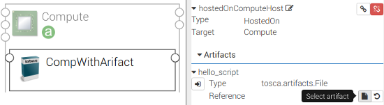

# 6. How to deploy a file or a folder (i.e., a `File`) to a target compute node?

#### 6.1. How to deploy a file?

During the deployment of a software component, sometimes you need an external file in the deployment. In such a case,
you can define an `artifacts` in the node definition as below:

```yaml
node_types:
  otc.nodes.SoftwareComponent.ComponentA:
    derived_from: tosca.nodes.SoftwareComponent
    interfaces:
      Standard:
        create: scripts/create.sh
    artifacts:
      - hello_script:
          type: tosca.artifacts.File
          # path to an existing file
          file: scripts/helloworld.js
```

The orchestrator will send the `file` (available at the path `scripts/helloworld.js`) to the compute node, on which the
software component is deployed.

To use `file` artifacts in an implementation of the `interfaces` (e.g., `create.sh`):

```shell script
# scripts/create.sh
cat $hello_script
```

The artifact name (e.g., `hello_script`) will be available as an environment variable in the implementation script,
which value is the path to the `file` deployed on the target compute node.

In the editor, you can also upload and replace the artifact `hello_script` for a given topology:



Figure 1: Click "Select Artifact" to replace an artifact

#### 6.2. How to deploy a folder?

The `file` artifact can be a folder as well:

```yaml
node_types:
    ...
    artifacts:
      - scripts:
          type: tosca.artifacts.File
          # path to an existing folder "myscripts" in the same path of types.yaml
          file: myscripts
```

In this example, the artifact name (e.g., `scripts`) is the path to the folder on the target compute node.

```shell script
# scripts/create.sh
ls $scripts
```

* See [full example](../examples/artifact/types.yml "Artifact example")