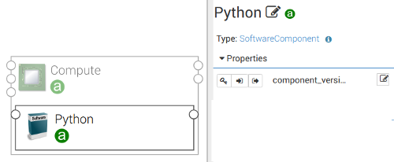

# 3. Define a `ConnectsTo` relationship between two software components

This example shows how to define a nodecellar connects to a mongodb as in Figure 1.



Figure 1

We have 3 steps to define a `ConnectsTo` relationship from nodecellar (a `SOURCE` node) to mongodb (a `TARGET` node) as
follows:

#### Step 1. Define a capability in the TARGET node (mongodb)

First, we define a new capability name `mongo_db` from type `tosca.capabilities.Endpoint.Database`:

```yaml
node_types:
  otc.nodes.SoftwareComponent.MongoDB:
    ...
    capabilities:
      # an arbitrary name
      mongo_db:
        # mongodb offers a capability Endpoint.Database for any SOURCE nodes to connect
        type: tosca.capabilities.Endpoint.Database
```

The `Endpoint` capability is where a `SOURCE` node gets information about the `TARGET` node to setup the connection
later on. The `Endpoint` capability is a TOSCA type with some default properties and attributes as in Figure 2:


Figure 2: The tosca.capabilities.Endpoint

* In the editor, users can specifiy values for the endpoint capability (e.g., `port`, `protocol`).
* The default attribute: `ip_address` (not shown in the Figure) is the IP address of the hosted compute node. The
orchestrator will set the `ip_address` in the endpoint capability automatically. A SOURCE node can get the `ip_address`
to setup a connection (more details in step 3).

#### Step 2. Define a requirement in the SOURCE node (nodecellar)

In this step, we define a new requirement **with the same name** `mongo_db` for nodecellar. We also define a `ConnectsTo`
relationship in the requirement as follows:

```yaml
node_types:
  org.alien4cloud.nodes.Application.Docker.Nodecellar:
    ...
    requirements:
      - mongo_db:
          # nodecellar requires a TARGET node to have a capability Endpoint.Database
          capability: tosca.capabilities.Endpoint.Database
          relationship: tosca.relationships.ConnectsTo
```

#### Step 3. Extend the interfaces of the SOURCE node to setup the connection

When we `create` a nodecellar node, we get the information from the TARGET node to setup the connection in nodecellar:

```yaml
node_types:
  org.alien4cloud.nodes.Application.Docker.Nodecellar:
    ...
    interfaces:
      Standard:
        create:
          inputs:
            ENV_MONGO_HOST: { get_attribute: [TARGET, mongo_db, ip_address] }
            ENV_MONGO_PORT: { get_property: [TARGET, mongo_db, port] }
            ENV_NODECELLAR_PORT: { get_property: [SELF, nodecellar_app, port] }
```

Notice:
* We use the keyword `TARGET` to reference to the target node in the relationship (i.e., the mongodb node).
* The attribute `ip_address` is the default attribute of the endpoint capability `mongo_db` (as we defined in step 1).
* We use `get_property` to get the properties from the endpoint capability `mongo_db` (e.g., `port`).

#### Advanced options

When we define the requirements:
* We can use `node` to match a target node type explicitly.
* We can specify how many relationship instances (e.g., one to one, one to two, etc.). The default value is one-to-one,
if not specified.

```yaml
node_types:
  org.alien4cloud.nodes.Application.Docker.Nodecellar:
    ...
    requirements:
      - mongo_db:
          capability: tosca.capabilities.Endpoint.Database
          relationship: tosca.relationships.ConnectsTo
          # (Optional) we accept only node type MongoDB
          node: otc.nodes.SoftwareComponent.MongoDB
          # (Optional) we specifiy relationship one-to-one
          occurrences: [1, 1]
```
